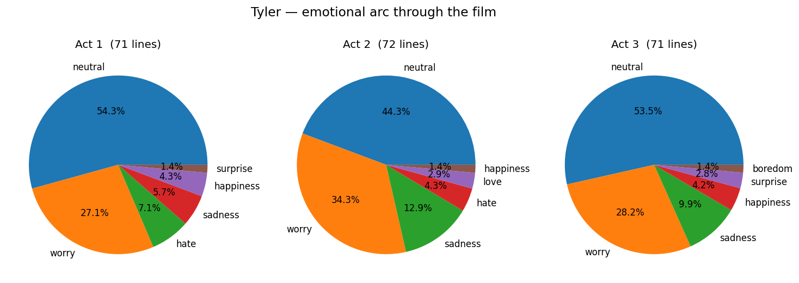
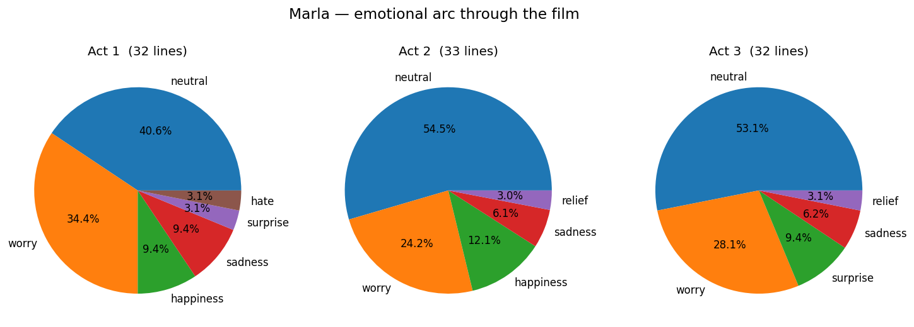
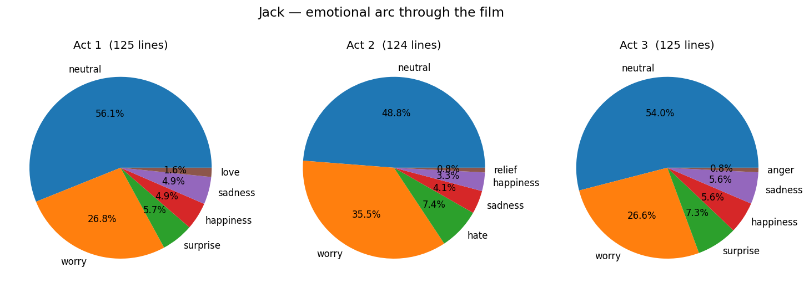

# Movie Dialogue Emotions

Train an emotion classifier on Twitter sentiment data, then point it at film dialogue and chart how a character's emotional state shifts across the runtime. The demo is Fight Club (Tyler / Marla / Jack) — but the pipeline accepts any movie ID and character list from the [Cornell Movie Dialogs Corpus](https://www.cs.cornell.edu/~cristian/Cornell_Movie-Dialogs_Corpus.html).

Originally a UNIMI Information Retrieval final project; refactored here into a clean modular pipeline as a portfolio piece.

## Character arcs

After running the pipeline, `reports/figures/` contains a three-panel emotional arc per character:

| Character | Arc |
| --- | --- |
| Tyler Durden |  |
| Marla Singer |  |
| Jack |  |

## Approach

- **Classifier.** TF-IDF (5 000 features, English stopwords) → LinearSVC on the Kaggle [Emotion Detection from Text](https://www.kaggle.com/datasets/pashupatigupta/emotion-detection-from-text) dataset (~40 k tweets, 13 sentiment classes).
- **Sparse throughout.** The TF-IDF matrix is kept sparse end-to-end; LinearSVC accepts it natively. The original notebook called `.toarray()` everywhere — densifying a 28 k × 5 000 matrix per stage was a bug worth fixing during the refactor.
- **Per-character analysis.** Filter the Cornell corpus to a movie ID, pull each character's lines, vectorise with the trained TF-IDF, predict an emotion per line.
- **Three-act arc.** Split each character's lines into three contiguous timeline buckets and render a top-emotions pie per act. The original notebook hardcoded the bucket boundaries per character; the refactor generalises to `N_TIMELINE_BUCKETS` (configurable).
- **Persisted artifacts.** Vectorizer, label encoder, and classifier are joblib-dumped to `models/` so `--analyze` works without retraining.

## Known limitations

- **Modest classifier accuracy.** TF-IDF + linear SVM on 13 heavily imbalanced classes hits roughly 30% accuracy on held-out tweets. Modern sentence embeddings (e.g. sentence-transformers) plus class-imbalance handling would be the obvious next step; that work is planned for a follow-up iteration.
- **Tweet-trained / dialogue-applied.** Domain shift between tweets and movie dialogue is real. The arcs are interpretable and entertaining, not clinical.

## Get the data

The two source datasets are not redistributed in this repo. Download and place them as follows:

```
data/
├── tweet_emotions.csv                          # Kaggle: pashupatigupta/emotion-detection-from-text
└── cornell movie-dialogs corpus/               # unzip the corpus as-is, keep the original folder name
    └── movie_lines.txt
```

## How to run

Prerequisites: Python 3.13.

```bash
python3.13 -m venv .venv
source .venv/bin/activate
pip install -r requirements.txt

python -m src.pipeline             # train + analyze (default)
python -m src.pipeline --train     # train only — persists to models/
python -m src.pipeline --analyze   # analyze only — loads models/, writes reports/figures/

pytest                              # run the unit tests
```

## Repo

```
movie-dialogue-emotions/
├── data/                  # raw inputs (gitignored)
├── models/                # joblib artifacts (gitignored)
├── reports/figures/       # character arc images (tracked)
├── src/
│   ├── config.py          # paths, hyperparams, movie ID & character list
│   ├── data.py            # tweet loader + Cornell movie_lines parser
│   ├── model.py           # TF-IDF + LabelEncoder + LinearSVC; train / persist / load / predict
│   ├── analysis.py        # split_into_thirds + analyze_character + plot_character_arc
│   └── pipeline.py        # train(), analyze(), CLI
├── notebooks/
│   └── exploratory.ipynb  # class distribution + sample predictions
├── tests/
│   ├── test_data.py       # movie_lines parser + character filter
│   └── test_analysis.py   # timeline bucketing
└── requirements.txt
```
